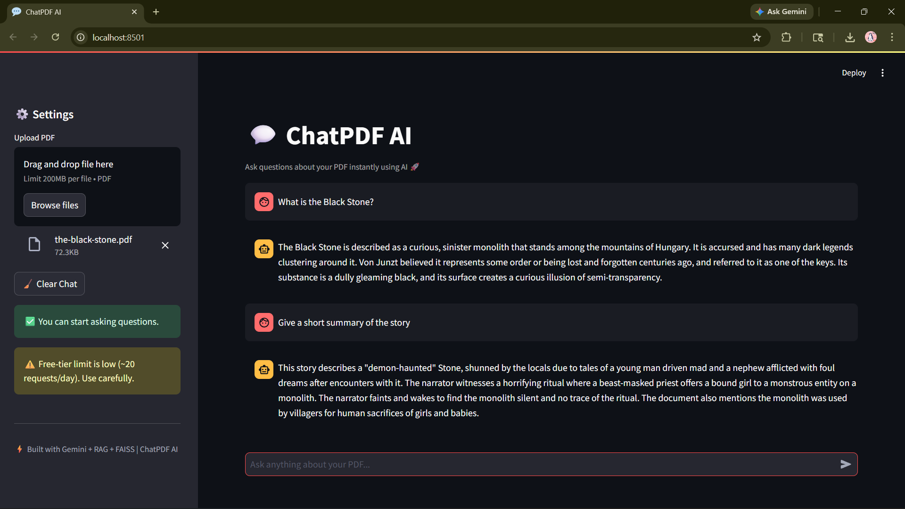
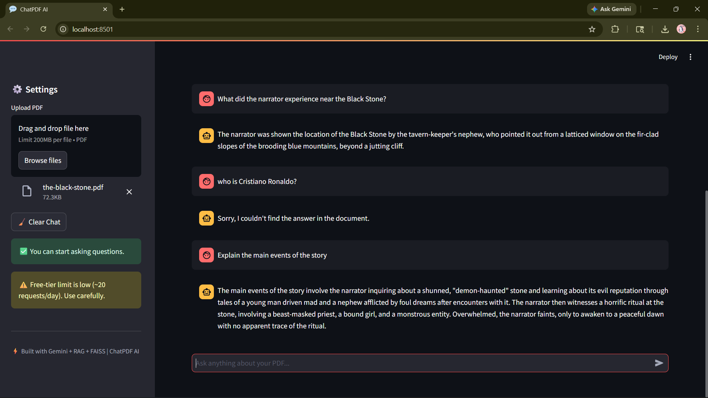

# 💬 ChatPDF AI – Intelligent Document Q&A System

## 📌 Problem Statement

ChatPDF AI is an **AI-powered document question-answering system** that allows users to upload PDF files and interact with them using natural language.

It uses a **Retrieval-Augmented Generation (RAG)** pipeline to retrieve relevant information from documents and generate accurate responses using **Google Gemini LLM**.

---

## 🚀 Project Overview

- 📄 Upload and chat with PDF documents
- 🔍 Context-based question answering using RAG
- ⚡ Semantic search using vector embeddings
- 🧠 Efficient document chunking and retrieval
- 🤖 AI-generated responses using Gemini
- 💬 Chat interface using Streamlit
- 🔁 Response caching to reduce API usage
- ⚠️ Handles API quota and network errors

---

## 🎯 Skills Takeaway

- Retrieval-Augmented Generation (RAG)
- FAISS vector database
- HuggingFace embeddings
- Prompt engineering
- LLM integration (Google Gemini API)
- Text preprocessing and chunking
- Streamlit UI development
- Error handling and optimization
- End-to-end AI application development 

---

## 📄 Input Data

- No predefined dataset required
- Users upload custom **PDF documents**
- Supports:
    - Resume analysis
    - Reports
    - Study materials
    - Any text-based PDF 

---

## 🧹 Data Processing Pipeline

- 📥 PDF text extraction using **PyPDF2**
- ✂️ Text splitting using **RecursiveCharacterTextSplitter**
- 📏 Chunk size: **800**
- 🔁 Overlap: **150**
- 📌 Maintains contextual continuity across chunks

---

## 🧠 Model & Architecture

### 🔹 Embedding Model

- **sentence-transformers/all-MiniLM-L6-v2**
- Converts text chunks into vector embeddings

### 🔹 Vector Database

- **FAISS (Facebook AI Similarity Search)**
- Stores embeddings for fast similarity search
- Enables retrieval of relevant document chunks

### 🔹 LLM (Generation)

- Google Gemini (gemini-2.5-flash)
- Generates responses based on retrieved context
- Uses prompt engineering for:
    - Context grounding
    - Friendly conversational tone
    - Controlled hallucination

---

## ⚙️ RAG Workflow

1. Upload PDF
2. Extract text
3. Split into chunks
4. Generate embeddings
5. Store in FAISS
6. User asks question
7. Retrieve top-k relevant chunks
8. Send context + query to Gemini
9. Generate final answer

---

## 📊 Features

- 💬 ChatGPT-like conversational UI
- 📄 In-memory PDF processing (no file saving)
- ⚡ Fast semantic retrieval
- 🧠 Context-aware responses
- 🔁 Cached responses using `st.cache_data`
- ⚠️ Handles:
    - API quota limits
    - Network issues
    - Unknown errors
- 🔐 Secure API key handling via `.env`

---

## 🌐 Streamlit Application

The Streamlit app allows users to:
- Upload PDF files
- Ask questions in natural language
- Receive AI-generated answers
- View chat history

---

## ▶️ Run the Streamlit App

```bash
streamlit run app.py
```

---

## 📸 Streamlit Screenshots





---

## 🔁 Reproducibility

- In-memory PDF processing (no file storage)
- Consistent chunking strategy
- Cached responses to reduce repeated API calls
- Environment variables managed via `.env`

Install dependencies:
```bash
pip install -r requirements.txt
```

---

## 🧪 Environment & Compatibility

### 🔹 Development Environment

- Platform: Local Machine (VS Code)
- Python: 3.10 / 3.11 recommended
- Framework: Streamlit

### 🔹 Key Libraries

- LangChain
- FAISS
- Sentence Transformers
- Google Generative AI (Gemini)
- PyPDF2

---

## ⚠️ Limitations

> Free-tier Gemini API has request limits (~20/day)

> Requires internet connection for LLM responses

> Large PDFs may increase processing time

---

## 🔮 Future Improvements

- 🔄 Streaming responses (typing effect)
- 📚 Multi-document support
- 📍 Show source page references
- ☁️ Deployment (Streamlit Cloud / AWS)
- 🧠 Local LLM fallback

---

## 👨‍💻 Author

**Nithis S J**

Aspiring AI/ML Engineer

---

⭐ If you found this project useful, feel free to star the repository!
